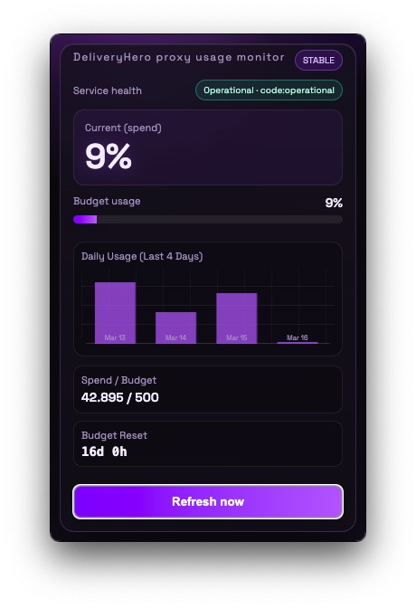

# DeliveryHero Claude Proxy Monitor

<p>
  <a href="https://github.com/sh981013s/dh-claude-usage-check/releases">
    
  </a>
</p>

DeliveryHero 프록시/LiteLLM 환경에서 Claude 사용량을 macOS 메뉴바에서 바로 확인하는 앱입니다.

## 데모



## 주요 기능
- 메뉴바에 현재 사용률(%) 표시
- 팝업 패널에서 Spend/Budget, Budget Reset, 서비스 상태 확인
- 최근 4일 일별 사용량 차트
- 다크 테마 UI + 애니메이션

## 다운로드 방법
1. [Releases 페이지](https://github.com/sh981013s/dh-claude-usage-check/releases)로 이동합니다.
2. 최신 버전에서 `.dmg` 파일을 다운로드합니다.
3. `.dmg`를 열고 `DH Claude Proxy Monitor.app`을 `Applications`로 드래그합니다.
4. 앱 실행 후 Claude Code 로그인/프록시 환경을 확인합니다.

## 로컬 실행(개발)
```bash
npm install
npm run start
```

## 빌드(개발/배포 테스트)
```bash
npm run dist
```

출력 위치: `dist/`
- `DH Claude Proxy Monitor-<version>-arm64.dmg`
- `DH Claude Proxy Monitor-<version>-arm64.zip`

## 서명/노타라이즈 배포(v0.1.2+)
릴리즈 워크플로우는 아래 Secrets가 모두 설정되면 자동으로 서명 + 노타라이즈 빌드를 수행합니다.

- `CSC_LINK`
- `CSC_KEY_PASSWORD`
- `APPLE_ID`
- `APPLE_APP_SPECIFIC_PASSWORD`
- `APPLE_TEAM_ID`

Secrets가 없으면 unsigned 빌드로 fallback 됩니다.

## 문제 해결
- 사용량이 안 보이면 `~/.claude/settings.json`의 프록시 설정과 Claude 로그인 상태를 먼저 확인하세요.
- 디버그 로그 확인:
```bash
claude --print "ping" --debug api --debug-file /tmp/claude-debug.txt
npm run scan:usage
```
